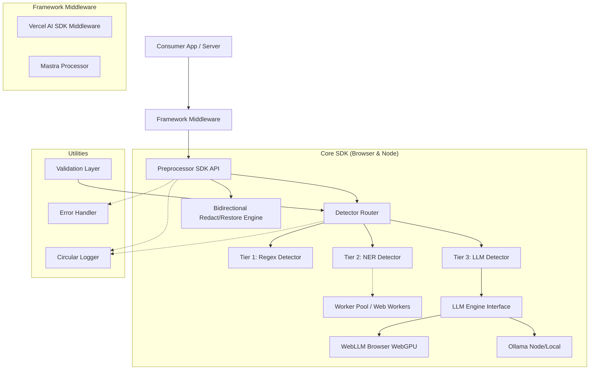

# Architecture Overview: RedactKit

This document explains the internal design, data flow, and components of RedactKit.

## 🧱 Component Diagram

## 🔄 Tiered Detection & Redaction Flow

RedactKit implements a three-tier PII detection pipeline to balance speed, privacy, and accuracy:

1. **Tier 1: Regular Expressions (Regex)**
   - High-speed, synchronous pattern matching for structural fields (e.g., Credit Cards, SSNs, Email Addresses, IP Addresses).
   - Serves as the first line of defense with zero cold start.

2. **Tier 2: Named Entity Recognition (NER)**
   - Uses `@huggingface/transformers` to run tiny, specialized language models on-device/locally.
   - Ideal for contextual PII like person names, locations, and organization names.
   - Can be offloaded to Web Workers in browser environments to prevent UI thread blocking.

3. **Tier 3: Large Language Model (LLM)**
   - High-reasoning classification using local models via WebLLM/WebGPU (browser) or Ollama (Node) to detect complex, implicit PII or custom document structures.
   - Validated by the `Validation Layer` to prevent hallucinations.

### Bidirectional Map Redaction (`redact` & `restore`)

When text is redacted:
1. The **Detector Router** evaluates the text across active tiers and returns non-overlapping entities (spans).
2. Spans are replaced with synthetic, format-preserving tokens (e.g., `[NAME_1]`, `[EMAIL_1]`).
3. A private, bidirectional `MapStore` maps the tokens back to their original values.
4. The redacted text is sent to external, untrusted LLM APIs.
5. On the LLM's response, the original values are safely rehydrated using the map store.

## 🔌 Framework Middleware

RedactKit integrates seamlessly into AI workflows via:
- **Vercel AI SDK Middleware**: Implements `LanguageModelV3Middleware` to automatically intercept and redact/restore text in prompt calls and streaming responses.
- **Mastra Processor**: Implements input/output guardrails to protect user privacy automatically.

## 🛠️ Key Design Choices

### Circular Memory Logging
To prevent memory leaks in long-running browser sessions, the internal logger uses a fixed-size buffer. When the buffer is full, the oldest logs are discarded.

### Strict Validation Layer
Since small models (1B-3B) are prone to hallucinations, the SDK includes a validation layer that calculates a "word-match ratio". If more than 20% of the extracted words don't exist in the source text, the extraction is flagged as invalid.

### Modular Architecture
Each core function (`redact`, `restore`, `clean`, `chunk`) can be used independently or combined into a pipeline.

