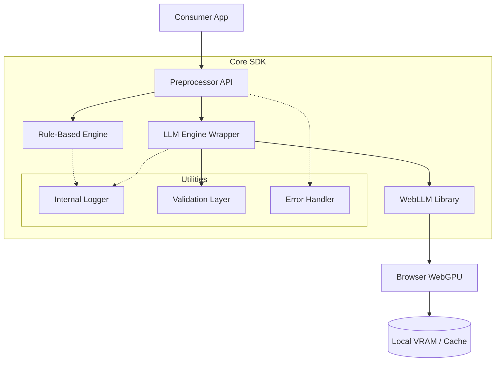

# Architecture Overview: Client-Side LLM Preprocessor

This document explains the internal design and data flow of the SDK.

## 🧱 Component Diagram

## 🔄 Data Flow

### 1. Rule-Based Flow (Sync/Async)
Rule-based operations (`cleanWithRules`, `chunk`) are deterministic and do not require the LLM engine. They use regular expressions and string manipulation for high-speed processing.

### 2. LLM-Based Flow (Async)
1. **Model Loading**: The `LLMEngine` initializes WebLLM, which checks for WebGPU and downloads/loads the model into the browser's cache.
2. **Preprocessing**: The `Preprocessor` class optionally cleans text using rules first to save tokens.
3. **Inference**: High-reasoning prompts are sent to the local model.
4. **Validation**: The raw output is passed through the `Validation Layer` to ensure JSON integrity and verify there are no hallucinations (comparing output words against source text).
5. **Logging**: Every step is recorded in a circular memory buffer (max 1000 entries) for debugging without memory leaks.

## 🛠️ Key Design Choices

### Circular Memory Logging
To prevent memory leaks in long-running browser sessions, the internal logger uses a fixed-size buffer. When the buffer is full, the oldest logs are discarded.

### Strict Validation Layer
Since small models (1B-3B) are prone to hallucinations, the SDK includes a validation layer that calculates a "word-match ratio". If more than 20% of the extracted words don't exist in the source text, the extraction is flagged as invalid.

### Modular Architecture
Each core function (`clean`, `chunk`, `extract`) can be used independently or combined into a `pipeline`.
